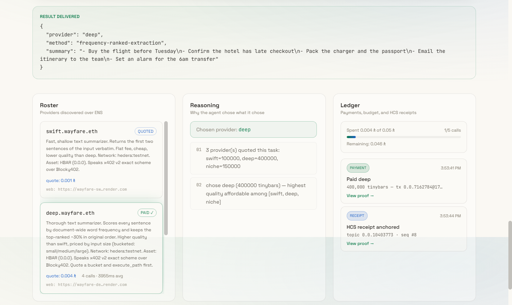
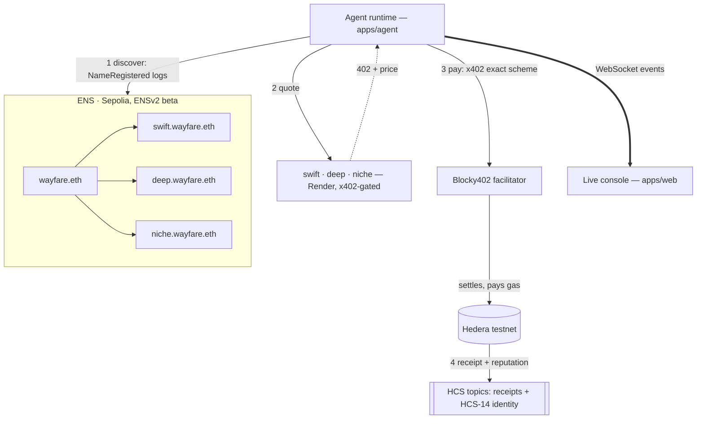
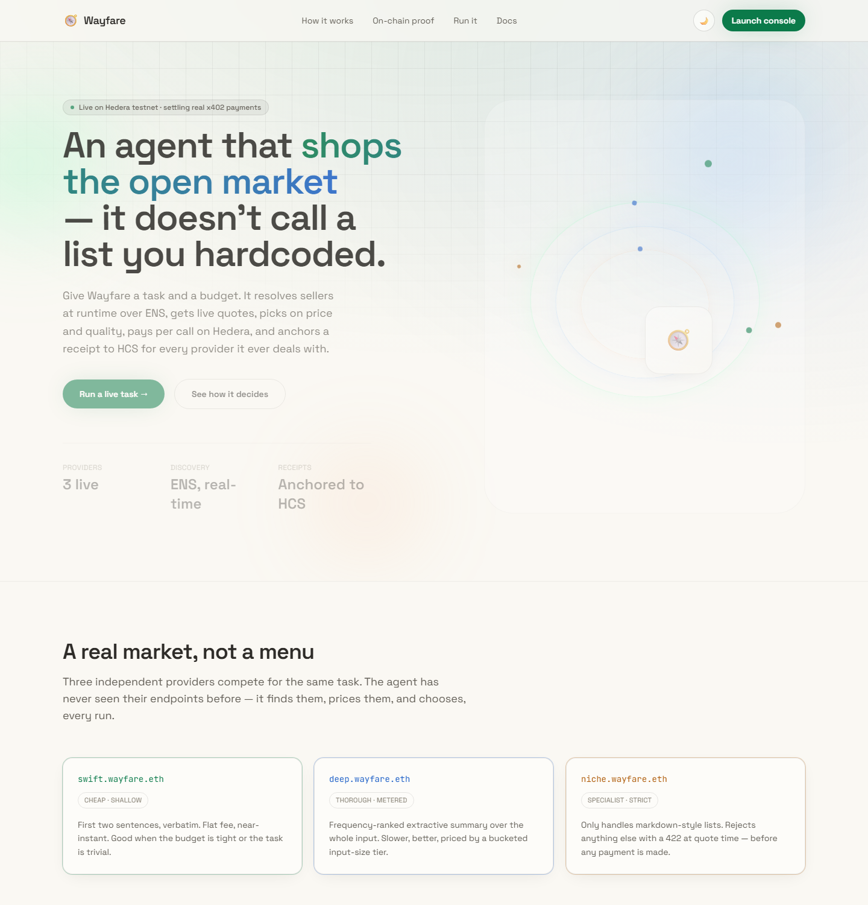

# Wayfare

An agent that discovers services it has never seen before, pays for them per call on
Hedera testnet via x402, and leaves a receipt trail anyone can check independently.



This README tracks what's actually built, not what's planned.

## The problem

Every "agentic payments" demo hardcodes the seller into the agent's source code. The
agent doesn't discover anything — the URL, the price, the whole relationship is already
in the codebase before the agent ever runs. That's not a market, it's a phone book with
extra steps. And it quietly skips the actual hard problem: how does an agent find a
service it's never seen before, decide whether it's worth paying, and prove afterward
what it got and what it paid?

## The solution

Wayfare's agent gets a task and a budget — nothing else. Discovery, pricing, and proof
all happen at runtime, not in config:

- It reads **ENS** to find out what sellers exist — real event-log enumeration off
  `wayfare.eth`'s subregistry, not a list baked into the agent.
- It asks each one for a price and drops anything that can't do the job (a provider that
  only handles markdown lists rejects prose before charging a cent).
- It picks the best option it can afford and pays over **x402** on Hedera testnet — one
  HBAR transfer per call, no API key, no subscription.
- It anchors a receipt to **Hedera Consensus Service** so anyone, not just this codebase,
  can verify who got paid, how much, and for what.

Discover → assess → decide → pay → consume → record. `apps/agent/src/runAgent.ts` is the
whole loop in one file, and it emits a typed event at every step — the live console above
is just rendering that stream, unmodified.

## Architecture



The facilitator is the only party that ever touches gas: the agent signs a transfer
authorizing its own payment, Blocky402 adds the network fee and submits it, and the
provider never holds a private key at all — confirmed on Mirror Node for every
settlement (see Status below).

## Status

- [x] M1 — one paid call. Settled for real on Hedera testnet via Blocky402:
      https://hashscan.io/testnet/transaction/0.0.7162784-1788608829-232641440
- [x] M2 — ENS resolution. `wayfare.eth` and `swift.wayfare.eth` are registered on real
      ENSv2 (beta) on Sepolia, resolving live via `packages/identity`. `wayfare.reputation`
      is gated by Enhanced Access Control — see `packages/identity/README.md`.
- [x] M3 — discovery replaces config. The agent finds providers by reading `NameRegistered`
      event logs off wayfare.eth's ENS subregistry — no provider name or URL anywhere in
      `apps/agent/src` (`grep -r "provider.*http" apps/agent/src` returns nothing).
- [x] M4 — choice. All three providers live, independently paid for real. Two runs with
      different budgets pick different providers, with the reasoning logged — see below.
- [x] M6 — receipts. Every settled call anchors to one HCS topic (provider ENS name,
      quote id, amount, tx id, result hash, timestamp), independently checkable on
      Mirror Node: https://testnet.mirrornode.hedera.com/api/v1/topics/0.0.10403773/messages
- [x] M8 — guardrails. Four hard limits enforced before every payment: max total spend, max
      price per call, max calls, and a balance floor checked against the *real* on-chain
      Hedera balance (not a local counter). A run with nothing affordable, or one that would
      drain the reserve, refuses before ever calling `fetchWithPayment` — never after.
- [x] Bonus — HCS-14 agent identity. The agent and each provider have a deterministic,
      independently-verifiable identity anchored to HCS — see `packages/receipts/README.md`.
- [x] M7 — frontend. Landing page plus a live console (Roster / Reasoning / Ledger) driven
      entirely by the agent's WebSocket event stream — see `apps/web/README.md`.
- [~] M5 — Bazantic. All three providers registered as real Gateways via the `baz` CLI;
      the Recipe (needed for the two remaining Bazantic prizes) is the one piece left —
      see `SPONSORS.md`.
- [ ] M9: not started

## Screenshots

Landing page:



The console screenshot at the top of this README is from a real run, captured live — not
staged: `- Buy the flight before Tuesday` etc. went in, the agent discovered all three
providers over ENS, quoted all three, picked `deep` (highest quality it could afford),
paid it for real, and anchored an HCS receipt, all visible in that one screenshot.

## Layout

```
apps/
  agent/               discovers providers over ENS, assesses quotes, decides, pays
  providers/
    swift/              fast/cheap text summarizer, x402-gated
    deep/                thorough, metered by input size (bucketed pricing)
    niche/               only handles markdown lists, fails loudly (422) otherwise
  web/                   landing page + live console (React, WebSocket-driven)
packages/
  identity/              ENS resolution + setup, real ENSv2 beta on Sepolia
  discovery/              Bazantic OpenAPI specs + integration notes
  receipts/              HCS topics — settlement receipts and HCS-14 identity
```

Task domain for the three providers: text summarization.
- `swift` — first two sentences verbatim. Cheap, shallow, flat fee.
- `deep` — frequency-ranked extractive summary over the whole input. Slower, better, priced
  by a bucketed input-size tier (small/medium/large).
- `niche` — only summarizes markdown-style lists. Rejects anything else at quote time with a
  422, before any payment — it doesn't guess outside its domain.

## Payment stack

- Protocol: [x402](https://x402.gitbook.io/x402/) v2, `exact` scheme, Hedera testnet
- SDK: `@x402/core`, `@x402/hedera`, `@x402/express` (provider), `@x402/fetch` (agent)
- Facilitator: [Blocky402](https://blocky402.com) hosted testnet instance —
  `https://api.testnet.blocky402.com`, open access, no API key. It holds the fee-payer
  key and submits/pays gas for every settlement; providers only ever declare a `payTo`
  account, never a private key.

## ENS layer

- `wayfare.eth` and its provider subnames live on ENSv2 (beta), on Sepolia — a genuinely
  different, newer contract set than the classic ENS v1 registry most tooling targets.
- Records follow [ENSIP-26](https://discuss.ens.domains/t/ensip-26-ens-native-ai-identity/21968):
  `agent-context` (free text describing the provider), `agent-endpoint[web]`, and a custom
  `wayfare.reputation` record that only a separate settlement-recorder key can write —
  enforced by Enhanced Access Control, not just convention. The agent actually updates it
  after every settled call (completed calls, mean latency), not just at setup. Details and
  setup scripts in `packages/identity/README.md`.

## Running it locally

You need a funded Hedera **testnet** account with an **ECDSA** key (the `@x402/hedera`
exact scheme currently assumes ECDSA). Get one free from the
[Hedera Portal](https://portal.hedera.com/) — it auto-funds new testnet accounts with
1000 test HBAR. Each provider needs its own merchant account too — `apps/agent/scripts/
create-merchant-account.ts` mints one from your funded account, no second portal signup.

1. `npm install` at the repo root (installs all workspaces).
2. Set up `wayfare.eth` and its provider subnames once — see `packages/identity/README.md`.
   (Already done for this repo's own `wayfare.eth`; a fresh fork needs its own registration.)
3. Copy each `apps/providers/*/.env.example` → `.env`, set `HEDERA_MERCHANT_ACCOUNT_ID`.
4. Copy `apps/agent/.env.example` → `.env`, set `HEDERA_PAYER_ACCOUNT_ID` /
   `HEDERA_PAYER_PRIVATE_KEY` (ECDSA, `0x`-prefixed).
5. Three terminals: `npm run dev:swift`, `npm run dev:deep`, `npm run dev:niche`.
6. From `apps/agent`, either:
   - CLI: `npx tsx src/index.ts "<some text to summarize>"`
   - or the live console: `npm run serve` (starts the WebSocket server), then from
     `apps/web`, `npm run dev` and open `http://localhost:5173`.

The agent discovers all three from ENS, asks each for a quote, drops any that can't handle
the input (niche 422s on non-list text before any payment), picks the highest-quality one
it can afford, and pays it. Run it again with a small budget —
`MAX_TOTAL_TINYBARS=150000 MAX_PRICE_PER_CALL_TINYBARS=150000 npx tsx src/index.ts "..."`
— and it picks swift instead, logging exactly why. Every run prints a HashScan link and a
Mirror Node link for the HCS receipt it anchored.

## Deployment

All three providers run for real on Render (free tier, auto-deploys from `master`):

- `https://wayfare-swift.onrender.com`
- `https://wayfare-deep.onrender.com`
- `https://wayfare-niche.onrender.com`

ENS `agent-endpoint[web]` for each provider points at its Render URL — the agent's
discovery in the steps above already resolves and calls these, not localhost. Free-tier
services on Render spin down after inactivity, so the first call after a while sleeps for
~30-60s before responding; hitting `/health` once before a demo wakes it back up.
